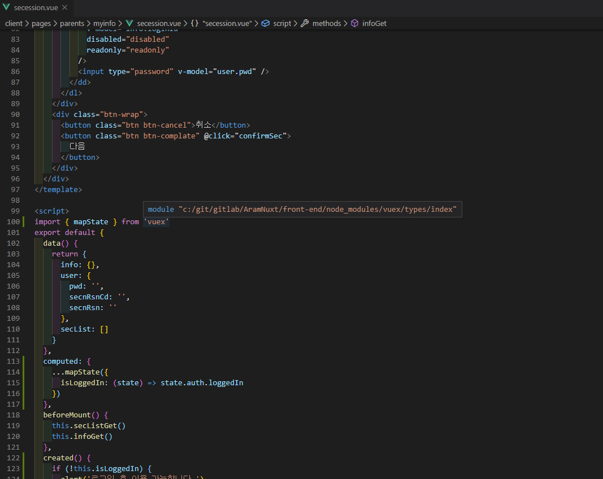
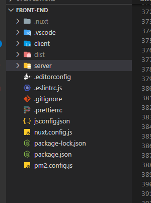
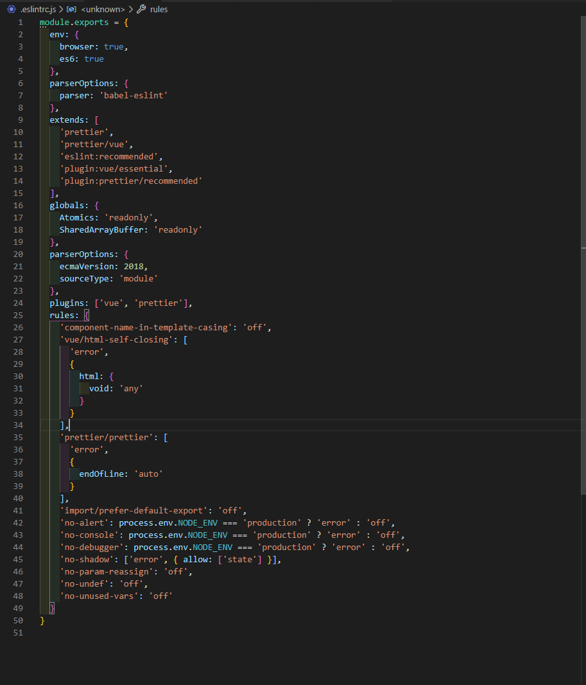
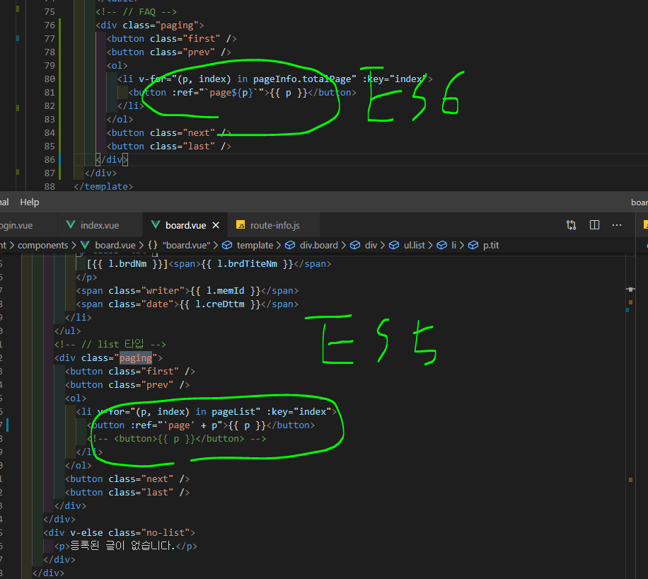
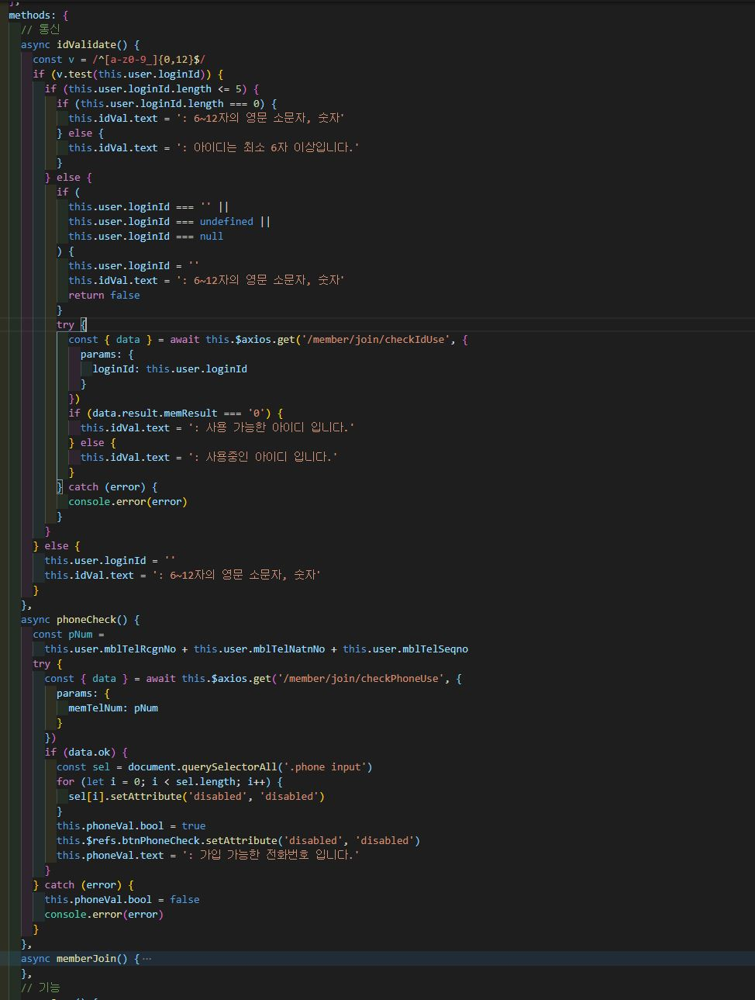

# 1주차

## 1장 ECMAScript

### 1-1 ECMAScript 탄생

자바스크립트는 1990년대 Netscape 회사의 Brendan Eich 라는 사람에 의해 최초 개발되었다.<br />
자바스크립트가 잘 되자, MS에서 Jscript라는 언어를 개발해 IE에 탑재하였는데, 이 두 스크립트가 너무 제각각이라,<br />
표준이 필요하게 되었다.<br />
표준을 위해 자바스크립트를 ECMA( European Computer Manufacturers Association ) 라는 정보와 통신시스템의<br />
비영리 표준 기구에 제출하였고 표준에 대한 작업을 ECMA-262란 이름으로 1996년 11월에 시작해 1997년 6월에<br />
채택되었다.

```
Ecma 인터내셔널의 SCMA-262 기술 규격에 의해 정의된 그리고 표준화 된 스크립트 프로그래밍 언어
```

<a href="https://www.youtube.com/watch?v=wcsVjmHrUQg" target="_blank">관련영상</a><br />
<a href="https://kangax.github.io/compat-table/es6/" target="_blank">브라우저 지원 현황</a>

---

### 1-2 JavaScript 와 ECMA Script

둘 다 뒤에 Script라는 키워드가 붙지만, 자바스크립트는 언어이고, ECMA 스크립트는 규격, 표준이다.

---

### 1-3 ES 버전에 따른 특징

ES3 (1999)

1. 함수단위 스코프
2. 호이스팅
3. 클로저
4. 프로토타입

ES5 (2009)

1. 배열에 forEach, map, filter, reduce, some, every와 같은 순환 메소드 지원 ( map, forEach 차이 )
2. Object에 대한 getter / setter 지원, Object.keys() 메소드를 이용한 for in 메소드도 대체
3. <a href="https://developer.mozilla.org/ko/docs/Web/JavaScript/Reference/Strict_mode" target="_blank">자바스크립트 strict 모드 지원</a>

```
엄격한 모드는 일부 이전에 허용되었던 실수를 오류로 바꿔 놓습니다. 자바 스크립트는 초보 개발자에게 쉬운 것이 되도록
설계되었으며, 때로는 오류를 일으킬만한  동작을 에러없이 시행합니다. 때때로 이것은 즉각적인 문제를 해결하지만, 때때로
이것은 더 심각한 문제를 만들어 냅니다. 엄격한 모드는 이러한 실수를 오류로 처리해서 그것을 발견하고 즉시 고칠 수 있도록
합니다.
```

5. JSON 지원 ( 과거에는 XML을 사용 )

ES6 (2015)

1. let, const 키워드 추가
2. arrow 문법 지원
3. iterator / generator 추가
4. module import / export 추가
5. Promise 도입

ES 8 (2017)

1. async — await

---

## 2장 자바스크립트 개발도구

1. <a href="https://nodejs.org/ko/" target="_blank">Node 설치</a>

- node.js는 JavaScript 기반으로 구성된 서버 사이드 서비스를 JavaScript로 구현할 수 있게 만든 런타임이고,<br />
  npm은 node.js 기반의 모듈을 모아둔 집합 저장소이다. npm은 Node Package Manager 또는 Node Package Modules
  라고도 한다.

```
npm install 명령어에는 지역(local) 설치와 전역(global) 설치 옵션이 있다. 옵션을 별도로 지정하지 않으면 지역으로
설치되며, 프로젝트 루트 디렉터리에 node_modules 디렉터리가 자동 생성되고 그 안에 패키지가 설치된다. 지역으로
설치된 패키지는 해당 프로젝트 내에서만 사용할 수 있다.

전역에 패키지를 설치하려면 npm install 명령어에 -g 옵션을 지정한다. 전역으로 설치된 패키지는 전역에서 참조할 수 있다.
모든 프로젝트가 공통 사용하는 패키지는 지역으로 설치하지 않고 전역에 설치한다.

전역에 설치된 패키지는 OS에 따라 설치 장소가 다르다.

- macOS의 경우

/usr/local/lib/node_modules

- 윈도우의 경우

c:\Users\%USERNAME%\AppData\Roaming\npm\node_modules
```



<br />
<br />


2. ES Lint ( 문법검사 )



https://velog.io/@kyusung/eslint-config-2

```
npx eslint app.js
```

```
eslint --init
```

3. Prettier ( 소스정리 )

```
{
  "arrowParens": "avoid", // 화살표 함수 괄호 사용 방식
  "bracketSpacing": false, // 객체 리터럴에서 괄호에 공백 삽입 여부
  "endOfLine": "auto", // EoF 방식, OS별로 처리 방식이 다름
  "htmlWhitespaceSensitivity": "css", // HTML 공백 감도 설정
  "jsxBracketSameLine": false, // JSX의 마지막 `>`를 다음 줄로 내릴지 여부
  "jsxSingleQuote": false, // JSX에 singe 쿼테이션 사용 여부
  "printWidth": 80, //  줄 바꿈 할 폭 길이
  "proseWrap": "preserve", // markdown 텍스트의 줄바꿈 방식 (v1.8.2)
  "quoteProps": "as-needed" // 객체 속성에 쿼테이션 적용 방식
  "semi": true, // 세미콜론 사용 여부
  "singleQuote": true, // single 쿼테이션 사용 여부
  "tabWidth": 2, // 탭 너비
  "trailingComma": "all", // 여러 줄을 사용할 때, 후행 콤마 사용 방식
  "useTabs": false, // 탭 사용 여부
  "vueIndentScriptAndStyle": true, // Vue 파일의 script와 style 태그의 들여쓰기 여부 (v1.19.0)
  "parser": '', // 사용할 parser를 지정, 자동으로 지정됨
  "filepath": '', // parser를 유추할 수 있는 파일을 지정
  "rangeStart": 0, // 포맷팅을 부분 적용할 파일의 시작 라인 지정
  "rangeEnd": Infinity, // 포맷팅 부분 적용할 파일의 끝 라인 지정,
  "requirePragma": false, // 파일 상단에 미리 정의된 주석을 작성하고 Pragma로 포맷팅 사용 여부 지정 (v1.8.0)
  "insertPragma": false, // 미리 정의된 @format marker의 사용 여부 (v1.8.0)
  "overrides": [
    {
      "files": "*.json",
      "options": {
        "printWidth": 200
      }
    }
  ], // 특정 파일별로 옵션을 다르게 지정함, ESLint 방식 사용
}
```

4. <a href="https://babeljs.io/repl#?browsers=defaults%2C%20not%20ie%2011%2C%20not%20ie_mob%2011&build=&builtIns=false&spec=false&loose=false&code_lz=Q&debug=false&forceAllTransforms=false&shippedProposals=false&circleciRepo=&evaluate=false&fileSize=false&timeTravel=false&sourceType=module&lineWrap=true&presets=env%2Ces2015%2Creact%2Cstage-2%2Cenv&prettier=false&targets=&version=7.10.2&externalPlugins=" target="_blank">Babel</a> (변환)

```js
let a = 3;
const test = (a, b) => a * b;

const { cat, dog, tiger, monkey = 'monkey' } = {
  cat: 'CAT',
  dog: 'DOG',
  tiger: 'TIGER',
};
```

```
npm install --save-dev @babel/core @babel/cli
npm install --save-dev @babel/preset-env
npm install --save-dev @babel/plugin-proposal-class-properties
```

Babel을 사용하려면 @babel/preset-env을 설치해야 한다. @babel/preset-env은 함께 사용되어야 하는 Babel 플러그인을 모아 둔 것으로 Babel 프리셋이라고 부른다. Babel이 제공하는 공식 Babel 프리셋(Official Preset)은 아래와 같다.

```
- @babel/preset-env
- @babel/preset-flow
- @babel/preset-react
- @babel/preset-typescript
```

@babel/preset-env 도 공식 프리셋의 하나이며 필요한 플러그인 들을 프로젝트 지원 환경에 맞춰서 동적으로 결정해 준다. 프로젝트 지원 환경은 Browserslist 형식으로 .browserslistrc 파일에 상세히 설정할 수 있다. 프로젝트 지원 환경 설정 작업을 생략하면 기본값으로 설정된다.

```
-w 타깃 폴더에 있는 모든 파일들의 변경을 감지하여 자동으로 트랜스파일한다. (--watch 옵션의 축약형)
-d 트랜스파일링된 결과물이 저장될 폴더를 지정한다. (--out-dir 옵션의 축약형)

npm run build
```

5. <a href="https://poiemaweb.com/es6-babel-webpack-2" target="_blank">webpack (번들)</a>


```
npm install --save-dev webpack webpack-cli
npm install --save-dev babel-loader
```

Promise, Object.assign, Array.from 등과 같이 ES5 이하로 대체할 수 없는 기능은 트랜스파일링이 되지 않는다.
따라서 오래된 브라우저에서도 ES6+에서 새롭게 추가된 객체나 메소드를 사용하기 위해서는 @babel/polyfill을 설치해야 한다.

```
npm install @babel/polyfill
```

node-sass는 node.js 환경에서 사용할 수 있는 Sass 라이브러리이다. 실제로 Sass를 css로 컴파일하는 것은 node-sass이다. style-loader, css-loader, sass-loader는 Webpack 플러그인이다.

```
$ npm install node-sass style-loader css-loader sass-loader --save-dev
```

---

## 3장 리터럴과 변수, 상수, 데이터 타입

### 3-1 선언자 식별자

```js
var(선언자) test(식별자)
let(선언자) test(식별자)
const(선언자) test(식별자)
```

- 식별자로 사용 가능한 문자는 알파벳, 숫자, 밑줄(\_), 달러 기호(\$) 이다.
- 첫 글자로 숫자는 사용 불가능하다.
- <a href="https://blog.sonim1.com/118" target="_blank">예약어</a>를 식별자로 사용할 수 없다.

---

### 3-2 변수 명명 규칙

- 카멜 케이스

  - newName, newNameCsc

- 파스칼 케이스

  - NewName, NewNameCsc

- 스네이크 케이스

  - new_name, new_name_csc

번외 : <a href="https://webclub.tistory.com/263" target="_blank">BEM</a>

---

### 3-3 데이터 타입

데이터 타입이란 숫자나 문자열처럼 변수에 저장하는 데이터의 종류를 이야기하며, C, C#, C++, Java 등의 프로그래밍 언어에는 정수 타입 변수, 부동소수점 타입 변수 등이 있어서 그 변수의 타입과 일치하는 데이터만 저장할 수 있다.

이처럼 변수에 타입이 있는 언어를 가르켜 <u>정적 언어 타입(static typed langeage)</u> 이라고 한다.

```
int num = 1; // 컴파일 성공
float num2 = 1.03; // 컴파일 성공
bool num3 = 1; // 컴파일 에러
```

정적 언어 타입과는 다르게 변수에 저장된 데이터 타입을 동적으로 바꿀 수 있는 언어를 가르켜 <u>동적 언어 타입(static typed langeage)</u>
이라고 부르며 대표적으로 JavaScript, Ruby, Python, SmallTalk 등이 있다.

#### 3-3-1 데이터 타입 분류

```
undefined : 변수가 정의되지 않거나 값이 없을 때
number : 데이터 타입이 수일 때
string : 데이터 타입이 문자열일 때
boolean : 데이터 타입이 불리언일 때
object : 데이터 타입이 함수, 배열 등 객체일 때
function : 변수의 값이 함수일 때
symbol : 데이터 타입이 심볼일 때
```

- 원시타입 : 숫자, 문자, 논리값, undefined, null, 심볼(es6+)

  - 데이터를 구성하는 가장 기본적인 요소로 불변값으로 정의<br />

  ```
  Boolean 타입의 값은 당연히 true와 false 2개 뿐입니다. 다른 값은 존재할 수 없습니다.
  Number 타입과 String 타입에는 조금 더 많은 값들이 존재합니다. 표준에 의하면 가능한
  Number 타입 값은 18,437,736,874,454,810,627 개입니다 (NaN을 포함해서요. NaN은 “Not a Number”를 의미하는 값입니다).
  String 타입은 훨씬 더 많은 값을 가질 수 있습니다
  ```

- 객체타입(Object) : 변수 여러 개가 모여서 만들어진 <u>복합 데이터 타입</u>

  ```
  객체 = '이름(key):값(value)' 의 형태로 프로퍼티(속성)들을 저장
  ```

- 객체는 참조 타입이며 객체 타입의 값을 변수에 대입하면 변수에는 그 객체에 대한 참조(메모리에서의 위치 정보)가 할당된다.

- 자바스크립트에서 배열, 함수, 정규표현식 같은 다양한 요소가 객체이다.

  - ECMAScript 함수는 일반 객체의 확장이며, 함수로 동작하기 위한 추가적인 기능을 가지고 있다.<br />

  ```
  function f() { return true; }
  console.log(f);
  console.dir(f);
  ```

- undefined 와 null 차이

  - 분명한 차이점은 undefined는 변수를 선언만 하더라도 할당되지만 null은 변수를 선언한 후에 null로 값을 바꾼다는 점입니다.

  - null 은 값은 값이지만 값으로써 의미없는 특별한 값이 등록되어 있는 것이고, undefined 는 등록이 되어있지 않기 때문에 초기화도 정의되지도 않은 것입니다.

  - undefined 는 미리 선언된 전역변수(전역 객체의 프로퍼티)이며, null 은 선언,등록을 하는 키워드인 것입니다.

  ```
  undefined = 존재하지 않음 / null = 값 없음
  ```

- 상수(Const)와 리터럴 차이

  - 상수는 프로그램 내의 항상 같은 값을 표현하는 것이며,<br />
    리터럴은 어떠한 값을 명칭하는 것이 아니라 변수 및 상수에 저장되는 '값 자체'를 말한다.

  - 변수나 상수는 메모리에 할당된 '공간' 이라면, 리터럴은 이 공간에 저장되는 '값'을 의미한다.

---

#### 3-3-2 Symbol

심볼은 자기 자신을 제외한 그 어떤 값과도 다른 유일무이한 값이다.

```js
const s1 = Symbol();
const s2 = Symbol();
const aSymbol_1 = Symbol('a');
const aSymbol_2 = Symbol('a');

console.log(s1 === s2); // false
console.log(aSymbol_1 === aSymbol_2); // false
```

같은 심볼을 사용하고 싶을 경우

```js
const s1 = Symbol();
const s2 = s1;
```

```js
const s1 = Symbol.for('mySym');
const s2 = Symbol.for('mySym');

console.log(s1 === s2);
```

---

#### 3-3-3 Symbol 활용

<a href="https://codevkr.tistory.com/83" target="_blank">설명</a>

심볼 타입은 주로 <u>객체의 고유한 프로퍼티의 값으로 사용</u>하는 목적으로 쓰인다.

```js
const a = Symbol();

const obj = {
  a: 'a 입니다',
  [a]: '조금 다른 a 입니다',
};

obj.a;
obj[a];

obj.a = 'b입니다';

obj.a;
obj[a];
```

---

#### 3-3-4 템플릿 문자열

ES6 이전에는 변수나 상수를 문자열 안에 포함시키는 방식

```js
var test = 20;
var txt = '내 나이는' + test + '입니다.';
console.log(txt);
```

ES6에서는 문자열 템플릿 이라는 기능을 도입 (백틱 사용)

```js
var test = 20;
var txt = `내 나이는${test}입니다.`;
console.log(txt);
```



---

#### 3-3-5 그외

- 배열
- 정규표현식
- 데이터 타입 변환

---

## 4장 제어문

- 조건문 : if/else문 / switch문 / catch/finally문
- 반복문 : while문 / do/while문 / for문 / for in문 / for of문
- 점프문 : break문 / continue문 / return문 / throw문

### 4-1 if/else 문

```js
if (!name) {
  // name이 nill, undefined, false, 0, -0, "", NaN 일 경우
  name = '';
  message = '이름을 입력하십시오';
}
```

### 4-2 switch 문

```js
const n = 2;
switch (n) {
  case 1:
    console.log('One');
    break;
  case 2:
    console.log('Two');
    break;
  case 3:
    console.log('Three');
    break;
  default:
    console.log('Other');
}
```

- break 대신 return 도 사용 가능

```js
const n = 2;
switch (n) {
  case 1:
    return n + 1;
  case 2:
    return n + 2;
  case 3:
    return n + 3;
    return;
  default:
    return n;
}
```

```js
const n = 2;
test(n);
function test(n) {
  switch (n) {
    case 1:
      console.log('일');
      return;
    case 2:
      console.log('이');
      return;
    case 3:
      console.log('삼');
      return;
    default:
      console.log('그외');
      return;
  }
}
```

### 4-3 while 문

- 조건이 맞으면 계속 반복 실행 (true)

```js
while (조건식) 문장;
```

```js
var n = 0;
var x = 0;

while (n < 3) {
  n++;
  x += n;
  console.log('n', n);
  console.log('x', x);
}
```

### 4-4 do / while 문

```js
let i = 10;
do {
  i -= 1;
  console.log(i);
} while (i < 5);
```

### 4-5 for 문

### 4-6 for in 문

```js
// 키 출력
var obj = { a: 1, b: 2, C: 3 };
for (var p in obj) {
  console.log('p = ' + p);
}
// 키값 출력
var obj = { a: 1, b: 2, C: 3 };
1;
for (var p in obj) {
  console.log('p = ' + obj[p]);
}
```

### <a href="https://gist.github.com/qodot/ecf8d90ce291196817f8cf6117036997">4-7 for of 문</a>

### 4-8 for each 문

### <a href="https://webclub.tistory.com/71">4-9 try/catch/finally 문</a>


