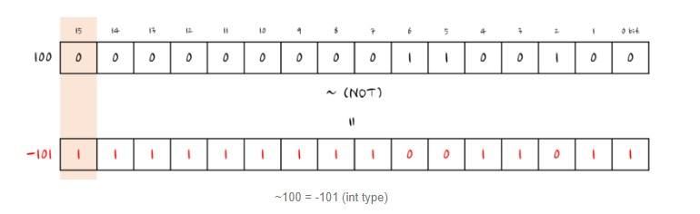

# 2주차

## 5장 표현식과 연산자

---

### 5-1 표현식의 의미

표현식이란 어떤 값을 만들어 냄을 의미합니다.

표현식을 평가한다는 것은 값과 변수, 함수 등의 값을 바탕으로 식의 값을 계산하는 행위를 뜻합니다.

변수, 프로퍼티, 배열 요소, 함수 호출, 메소드 호출도 표현식입니다.

```js
2 + (2 * 3) / 2(Math.random() * (100 - 20)) + 20;

functionCall();

window.history ? useHistory() : noHistoryFallback();

1 + 1, 2 + 2, 3 + 3;

declaredVariable;

true && functionCall();

true && declaredVariable;
```

위의 모든 코드는 표현식입니다. 그리고 표현식은 자바스크립트 코드 중 값이 들어가는 곳이면 어디에나 넣을 수 있습니다.

그래서 아래 console.log의 인자는 콘솔이 로깅될 때 하나의 값으로 변합니다.

```js
console.log(true && 2 * 9); // 18
```

---

### 5-2 연산자 기본

연산자는(Operator)를 사용하면 표현식을 조합해 복잡한 표현식을 만들어 낼 수 있습니다.

```
a + b
```

여기서 + 는 연산자이며, a와 b부분은 연산 대상이 되는 표현식이며, a와 b를 피연선자(오퍼랜드, Operand)라고 합니다.

'+' 연산자 왼쪽 오른쪽 총 두개의 피연산자가 있고, 이를 `이항연산자` 라고 부릅니다.

표현식은 왼쪽에서 오른쪽으로 피연산자의 값을 평가하고 이후에 연산이 시작됩니다.

```
일부 예외로 ||, &&. ? : 은 연산자부터 평가된 다음 피연산자를 평가합니다.
```

---

### 5-2-1 단항 연산자

단항 연산자는 연산자를 기준으로 피연산자가 하나인 연산자를 의미하고 연산의 우선 순위가 가장 높습니다.

- 숫자화 연산자 ( + )

- 단항 부정 연산자 ( - )

- !(논리부정) : 논리값을 부정 - true 는 false로 false 는 true 로 바뀜

```js
let a = !true;
a = !a;
```

- ~(비트부정) : 해당 데이터의 각 비트를 0은 1로 1은 0으로 바뀜

```js
let a = -1;
let c = ~a;
console.log(`a : ${a}`);
console.log(`c : ${c}`);
```



---

### 5-2-2 삼항 연산자

```js
표현식 ? 참 : 거짓;
```

삼항연산자는 if문의 축약형 입니다.

```js
let age = 29;
let canDrinkAlcohol = age > 19 ? 'True, over 19' : 'False, under 19';
console.log(canDrinkAlcohol);
```

```js
let condition1 = true,
  condition2 = false,
  access = condition1
    ? condition2
      ? 'true true'
      : 'true false'
    : condition2
    ? 'false true'
    : 'false false';

console.log(access); // logs "true false"
```

---

### 5-2-3 연산자 우선 순위와 연산자 결합 법칙

```
2 + 3 * 4
(2 + 3) * 4 // () -> 그룹 연산자

24 / 6 * 2
24 / (6 * 2) // 우선 순위가 같은 연산자일 경우에도 그룹 연산자가 최우선
```

`왼쪽 -> 오른쪽` 과 같은 연산 순서를 결합 법칙이라고 한다.

---

### 5-2-4 연산자의 부수효과

x + y 같은 표현식은 변수의 값을 바꾸지 않지만, x = y 처럼 대입하는 표현식과 증감 연산자 감소 연산자, delete는

값에 변경이 일어나는 부수효과가 있는 연산자 입니다.

```js
const Employee = {
  firstname: 'John',
  lastname: 'Doe',
};

console.log(Employee.firstname);

delete Employee.firstname;

console.log(Employee.firstname);
```

---

### 5-3 할당 연산자

할당 연산자는 오른쪽 피연산자의 값을 왼쪽 피연산자에 할당합니다.

기본적인 할당 연산자는 오른쪽의 피연산자 값을 왼쪽 피연산자 값에 할당하는 등호(=) 입니다.

즉 x = y 는 y 값을 x에 할당합니다.

- 구조분해 할당

```js
var foo = ['one', 'two', 'three'];

// 구조 분해를 활용하지 않은 경우
var one = foo[0];
var two = foo[1];
var three = foo[2];

// 구조 분해를 활용한 경우
var [one, two, three] = foo;
```

### 5-4 비교 연산자

비교 연산자는 피연산자들을 비교하고 비교에 따라 논리 값을 반환합니다.

피연산자들은 숫자, 문자열, 논리형, 객체 를 사용할 수 있습니다.

만약 두 피연산자가 다른 형태일 경우, JavaScript는 대부분 비교를 위해 피연산자를 적절한 타입으로 변환합니다.

이런 행동은 보통 숫자로 피연산자를 숫자로 비교하는 형태로 나타납니다.

형태를 바꾸기의 유일한 예외는 엄격한 비교를 수행하는 === 과 !== 연산이 관련되는 경우입니다.

이런 연산자는 비교를 위해 피연산자의 형태를 적절히 바꾸려고 시도하지 않습니다.


---

### 5-5 산술 연산자


```
 - 나누기 (/)
```

산술 연산자는 피연산자가 숫자인 연산자이며, 피연산자가 숫자가 아닐 때는 연산자가 피연산자 타입을 숫자로

바꾸어 연산합니다.

```js
1 + ture;
1 * false;
1 + null;
```

### 5-5-1 산술 연산자 특징

1. 부동소수점

```js
7 / 2; // 3.5
```

2. 나머지 연산자(%)의 피연산자는 부동소수점입니다.

```js
일부 프로그래밍 언어에서 정수의 나머지 값만 나머지 연산자로 사용 가능한 반면에 자바스크립트에선
모든 부동소수점을 사용 가능합니다.

5 % 1.5 // 0.5
```

3. \+ 연산자는 피연산자 중 하나가 문자열이면 나머지 피연산자를 문자열로 만듭니다.

```js
let m = 1 + '2month';
typeof m;
```

- 형변환에 활용

```js
'1' * 1;
```

4. 계산이 불가능한 경우에는 `NaN` 으로 평가합니다.

```js
0 / 0;
'ONE' * 1;
1 + undefined; // undefined 를 NaN 으로 바꿈
```
