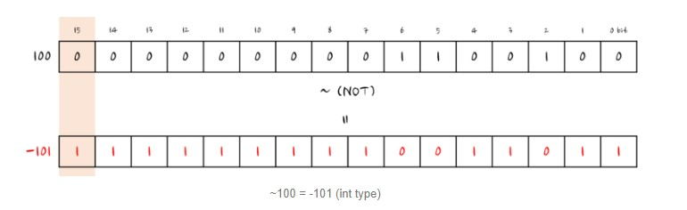
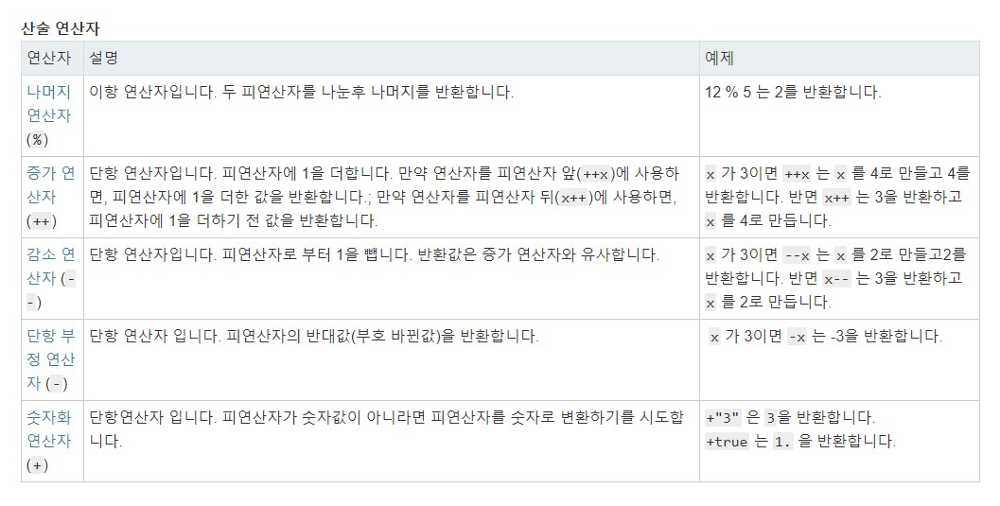

# 2주차

## 5장 표현식과 연산자

---

### 5-1 표현식의 의미

표현식이란 어떤 값을 만들어 냄을 의미합니다.

표현식을 평가한다는 것은 값과 변수, 함수 등의 값을 바탕으로 식의 값을 계산하는 행위를 뜻합니다.

변수, 프로퍼티, 배열 요소, 함수 호출, 메서드 호출도 표현식입니다.

```js
2 + (2 * 3) / 2(Math.random() * (100 - 20)) + 20;

functionCall();

window.history ? useHistory() : noHistoryFallback();

1 + 1, 2 + 2, 3 + 3;

declaredVariable;

true && functionCall();

true && declaredVariable;
```

위의 모든 코드는 표현식입니다. 그리고 표현식은 자바스크립트 코드 중 값이 들어가는 곳이면 어디에나 넣을 수 있습니다.

그래서 아래 console.log의 인자는 콘솔이 로깅될 때 하나의 값으로 변합니다.

```js
console.log(true && 2 * 9); // 18
```

---

### 5-2 연산자 기본

연산자는(Operator)를 사용하면 표현식을 조합해 복잡한 표현식을 만들어 낼 수 있습니다.

```
a + b
```

여기서 + 는 연산자이며, a와 b부분은 연산 대상이 되는 표현식이며, a와 b를 피연선자(오퍼랜드, Operand)라고 합니다.

'+' 연산자 왼쪽 오른쪽 총 두개의 피연산자가 있고, 이를 `이항연산자` 라고 부릅니다.

표현식은 왼쪽에서 오른쪽으로 피연산자의 값을 평가하고 이후에 연산이 시작됩니다.

```
일부 예외로 ||, &&. ? : 은 연산자부터 평가된 다음 피연산자를 평가합니다.
```

---

#### 5-2-1 단항 연산자

단항 연산자는 연산자를 기준으로 피연산자가 하나인 연산자를 의미하고 연산의 우선 순위가 가장 높습니다.

- 숫자화 연산자 ( + )

- 단항 부정 연산자 ( - )

- !(논리부정) : 논리값을 부정 - true 는 false로 false 는 true 로 바뀜

```js
let a = !true;
a = !a;
```

- ~(비트부정) : 해당 데이터의 각 비트를 0은 1로 1은 0으로 바뀜

```js
let a = -1;
let c = ~a;
console.log(`a : ${a}`);
console.log(`c : ${c}`);
```



---

#### 5-2-2 삼항 연산자

```js
표현식 ? 참 : 거짓;
```

삼항연산자는 if문의 축약형 입니다.

```js
let age = 29;
let canDrinkAlcohol = age > 19 ? "True, over 19" : "False, under 19";
console.log(canDrinkAlcohol);
```

```js
let condition1 = true,
  condition2 = false,
  access = condition1
    ? condition2
      ? "true true"
      : "true false"
    : condition2
    ? "false true"
    : "false false";

console.log(access); // logs "true false"
```

---

#### 5-2-3 연산자 우선 순위와 연산자 결합 법칙

```
2 + 3 * 4
(2 + 3) * 4 // () -> 그룹 연산자

24 / 6 * 2
24 / (6 * 2) // 우선 순위가 같은 연산자일 경우에도 그룹 연산자가 최우선
```

`왼쪽 -> 오른쪽` 과 같은 연산 순서를 결합 법칙이라고 한다.

---

#### 5-2-4 연산자의 부수효과

x + y 같은 표현식은 변수의 값을 바꾸지 않지만, x = y 처럼 대입하는 표현식과 증감 연산자 감소 연산자, delete는

값에 변경이 일어나는 부수효과가 있는 연산자 입니다.

```js
const Employee = {
  firstname: "John",
  lastname: "Doe",
};

console.log(Employee.firstname);

delete Employee.firstname;

console.log(Employee.firstname);
```

---

### 5-3 할당 연산자

할당 연산자는 오른쪽 피연산자의 값을 왼쪽 피연산자에 할당합니다.

기본적인 할당 연산자는 오른쪽의 피연산자 값을 왼쪽 피연산자 값에 할당하는 등호(=) 입니다.

즉 x = y 는 y 값을 x에 할당합니다.

- 구조분해 할당

```js
var foo = ["one", "two", "three"];

// 구조 분해를 활용하지 않은 경우
var one = foo[0];
var two = foo[1];
var three = foo[2];

// 구조 분해를 활용한 경우
var [one, two, three] = foo;
```

---

### 5-4 비교 연산자

비교 연산자는 피연산자들을 비교하고 비교에 따라 논리 값을 반환합니다.

피연산자들은 숫자, 문자열, 논리형, 객체 를 사용할 수 있습니다.

만약 두 피연산자가 다른 형태일 경우, JavaScript는 대부분 비교를 위해 피연산자를 적절한 타입으로 변환합니다.

이런 행동은 보통 숫자로 피연산자를 숫자로 비교하는 형태로 나타납니다.

형태를 바꾸기의 유일한 예외는 엄격한 비교를 수행하는 === 과 !== 연산이 관련되는 경우입니다.

이런 연산자는 비교를 위해 피연산자의 형태를 적절히 바꾸려고 시도하지 않습니다.

- == : 동일 연산자
- != : 비동일 연산자
- === : 일치 연산자
- !== : 불일치 연산자
- \>
- \<
- \>=
- \<=

```js
null == undefined;
1 == "1";
"0xff" == 255;
true == 1;
true == "1";
new String("a") == "a";
new Number(2) == 2;
[2] == 2;
```

---

### 5-5 논리 연산자

- \&& : 논리곱
- \|| : 논리합
- \!a : 부정 (a가 true면 false, false면 ture)

논리 연산자의 피연산자는 논리값이 아닐 경우 타입을 변환합니다.

```
0, -0, "", NaN, null, undefined = false
0을 제외한 모든 숫자, 빈 문자열을 제외한 모든 문자열, 모든 객체, 심볼 = true
```

---

### 5-6 산술 연산자



```
 - 나누기 (/)
```

산술 연산자는 피연산자가 숫자인 연산자이며, 피연산자가 숫자가 아닐 때는 연산자가 피연산자 타입을 숫자로

바꾸어 연산합니다.

```js
1 + ture;
1 * false;
1 + null;
```

#### 5-6-1 산술 연산자 특징

1. 부동소수점

```js
7 / 2; // 3.5
```

2. 나머지 연산자(%)의 피연산자는 부동소수점입니다.

```js
일부 프로그래밍 언어에서 정수의 나머지 값만 나머지 연산자로 사용 가능한 반면에 자바스크립트에선
모든 부동소수점을 사용 가능합니다.

5 % 1.5 // 0.5
```

3. \+ 연산자는 피연산자 중 하나가 문자열이면 나머지 피연산자를 문자열로 만듭니다.

```js
let m = 1 + "2month";
typeof m;
```

- 형변환에 활용

```js
"1" * 1;
```

4. 계산이 불가능한 경우에는 `NaN` 으로 평가합니다.

```js
0 / 0;
"ONE" * 1;
1 + undefined; // undefined 를 NaN 으로 바꿈
```

#### 5-6-2 산술 연산자 대입

산술 대입 연산자는 대입 연산자와 산술 이항 영산자를 조합한 연산을 좀 더 간략하게 표기한 것입니다.

```
'A += B'는 'A = A + B'입니다.
'A -= B'는 'A = A - B'입니다.
'A *= B'는 'A = A * B'입니다.
'A /= B'는 'A = A / B'입니다.
'A %= B'는 'A = A % B'입니다.
```

전위 표기법, 후위 표기법

```js
a = 1;
b = ++a; // b = 1 + a 가 실행 후 a = a + 1 이 실행
c = a++ + 2;
```

---

### 5-7 문자열 제어하기

\+ 연산자는 피연산자 중에 문자열이 있으면 다른 피연산자를 문자열로 변환해서 연결합니다.
(문자열로 변환 가능한 객체이면 객체도 문자열로 변환)

```js
"안녕" + "잘가";

let a = "1" + "2";
typeof a;

1 + { a: 1 };

"오늘은 " + new Date();
```

#### <a href="https://codedragon.tistory.com/6465">5-7-1 String 객체의 주요 메서드</a>

```js
let txt = "ECMA SCRIPT 2015";
txt.length; // 16 (공백 포함)
txt[2]; // 'M' (문자열을 배열처럼 사용)
```

---

### <a href="https://developer.mozilla.org/ko/docs/Web/JavaScript/Reference/Global_Objects/eval">5-8 eval 함수</a>

```js
console.log(eval("2 + 2")); // 4
```

- 편리하지만 보안 문제와 실행 속도의 문제가 있으므로 가능하다면 다른 대안을 사용하는 걸 추천합니다.

---

### 5-9 명시적 타입 변환

```js
typeof
```

#### 5-9-1 숫자를 문자열로 변환

```js
let n = 26;
typeof n;
```

```js
let n = 26;
typeof n.toString();
```

```js
let n = 26;
typeof (n + "");
```

---

#### 5-9-2 문자열을 숫자로 변환

```js
let n = "26";
typeof (n - 0);
```

```js
let n = "26";
typeof +n;
```

```js
let n = "26";
typeof (n * 1);
```

---

## 6장 함수

### 6-1 함수의 기초

함수(function)란 하나의 특별한 목적의 작업을 수행하도록 설계된 독립적인 블록을 의미합니다.

이러한 함수는 필요할 때마다 호출하여 해당 작업을 반복해서 수행할 수 있습니다.

```
- 매개변수, 인자(parameter) : 함수를 정의할 때
- 인수(argument) : 함수를 호출할 때
```

- 함수 선언식

```js
function test(n) {
  console.log(n);
}
```

- 함수 표현식

```js
let test = function (n) {
  console.log(n);
};
test(4);
```

- 함수 표현식과 함수 선언의 차이점 : 호이스팅

```js
sayHi(); // 'hi'
sayHello(); // what?? 그런 함수 없어

var hi = "hi";
function sayHi() {
  console.log("hi");
}
var sayHello = function () {
  console.log("hello");
};
```

```
Hoisting의 개념: 자바스크립트 엔진이 script 태그를 만나면 자바스크립트 파일을 먼저 쭉 읽으면서 선언된 변수와 함수를
메모리에 저장한다. 위의 코드를 예로 들면 먼저 변수 hi와 sayHi 함수(전체), sayHello 변수가 메모리에 저장되는 것이다.
이 과정이 끝나면 코드가 위에서 부터 차례대로 실행되는데 sayHi() 함수의 경우 메모리에 저장되어 있기 때문에 문제없이
실행되지만 sayHello의 경우 아직 값이 할당되기 전이기 때문에 에러가 발생한다.

때문에, 함수 선언으로 생성된 함수는 함수가 정의되기 전에 실행이 가능하며 함수 표현식은 그렇지 않다.
```

---

### 6-2 반환(return)문

```js
function multiNum(x, y) {
  x * y;
}
var num = multiNum(3, 4);
console.log(num);
```

```js
function multiNum(x, y) {
  return x * y; // x와 y를 곱한 결과를 반환함.
}
var num = multiNum(3, 4); // multiNum() 함수가 호출된 후, 그 반환값이 변수 num에 저장됨.
console.log(num);
```

---

### 6-3 인수를 객체로 전달

```js
function test(x, y, z) {
  console.log("x", x);
  console.log("y", y);
  console.log("z", z);
}
test(1, 2, 3);
```

```js
let params = { x: 1, y: 2, z: 3 };

function test(params) {
  console.log("x", params.x);
  console.log("y", params.y);
  console.log("z", params.z);
}
test(params);
```

---

### 6-4 메서드

메서드는 객체의 키값이 함수인 경우를 말합니다.

```js
console.log({ Number });
```

```
Number 메소드는 Number 객체에 정의되어 있는 숫자와 관련된 작업을 할 때 사용하는 메소드입니다.

1. Number.parseFloat()
2. Number.parseInt()
3. Number.isNaN()
4. Number.isFinite()
5. Number.isInteger()
6. Number.isSafeInteger()
```

---

### 6-5 즉시 실행 함수

```js
let f = function() {...}
f();
```

```js
(function() {...})();
```

---

### 6-6 재귀 함수

```js
function fact(n) {
  if (n <= 1) return 1;
  return n * fact(n - 1);
}
fact(5);
```

---

### 6-7 화살표 함수

```js
/* Function expression */
function square(n) {
  return n * n;
}

/* Arrow function */
const square = (n) => {
  return n * n;
};

/* Arrow function without block */
const square = (n) => n * n;
// 블록을 사용하지 않는다면, return을 생략한채로 값을 반환할 수 있다.

/* Arrow function with multiple parameters */
const power = (n, e) => n ** e;
// 여러 개의 인자를 사용할 떄에는 파라미터들을 ()로 묶어줘야 한다.

/* Arrow function returns simple object */
const createObj = (n) => ({
  number: n,
});
// 단순 객체를 반환하기 위해서는 객체 리터럴을 ()로 묶어줘야 한다.
```

```js
const obj = {
  name: "dongsu",
  test: function () {
    console.log("1st", this);
    function innerTest() {
      console.log("2nd", this);
      console.log("name", this.name);
    }
    return innerTest();
  },
};
obj.test();
```

위의 예제에서의 첫번째 this는 obj객체를 바라봅니다.

두번쨰 this는 window객체 혹은 undefined를 나타낼 것입니다.

일반적으로 this객체는 부모와 자식간의 상속에서 발생합니다.

자바스크립트에서 생성자 혹은 객체의 프로퍼티(메소드)를 사용하지 않는경우 this는 전역객체가 됩니다.

위의 코드에서 함수 innerTest는 생성자 혹은 메소드가 아니기 때문에 전역객체를 가리키게 됩니다.

그렇기 때문에 크롬 브라우저에서 테스트를 해보면 두번째 this가 window 객체를 바라보게 되는것이죠

그렇다면 화살표 함수를 사용했을때는 어떻게 될까?

`기본적으로 화살표 함수는 this객체를 bind하지 않습니다.`

```js
const obj = {
  name: "dongsu",
  test: function () {
    console.log("1st", this);
    const inner = () => {
      console.log("2nd", this);
      console.log("name", this.name);
    };
    return inner();
  },
};
obj.test();
```

```
화살표 함수를 사용하면 안되는 경우

- 메소드 정의, 프로토타입에 메소드 할당할 경우 => 메소드를 소유한 객체가 아닌 상위 컨텍스트인 전역객체 window 를 가리키게 된다.
- 생성자 함수로 사용할 경우 => 화살표 함수는 prototype을 갖고있지 않다.
- addEventListener 함수의 콜백 함수 => 화살표 함수를 사용할 경우 전역 객체 window를 가리킨다.
```

https://beomy.tistory.com/6

---

## 7장 스코프

### 7-1 전역 스코프

프로그램을 시작할 때 암시적으로 주어지는 스코프가 전역 스코프입니다.

즉, 어떤 함수도 호출하지 않았을 때 실행의 흐름은 전역 스코프에 있고 전역 스코프에 선언된 것들을 전역 변수라고 합니다.

```js
var name = "csc";
var age = "35";

function greet() {
  console.log(`Hello, ${name}!`);
}

function getBirthYear() {
  return new Date().getFullYear() - age;
}
```

전역 변수는 프로그램 어디서든 값을 쉽게 변경할 수 있으므로 객체 형태로 보관하는 방법을 추천합니다.

```js
var user = {
  name: "csc",
  age: 25,
};

function greet() {
  console.log(`Hello, ${user.name}!`);
}

function getBirthYear() {
  return new Date().getFullYear() - user.age;
}
```

---

### 7-2 함수 스코프

```js
var(선언자) test(식별자)
```

```js
function sayHello() {
  const hello = "Hello CSS-Tricks Reader!";
  console.log("hello", hello);
}

sayHello(); // 'Hello CSS-Tricks Reader!'
console.log(hello); // Error, hello is not defined
```

---

### 7-3 블록 스코프

let 과 const 는 식별자를 블록 스코프에서 선언하고 그 블록의 스코프에서만 사용 가능한 식별자를 의미합니다.

```js
let(선언자) test(식별자)
const(선언자) test(식별자)
```

```js
{
  const x = 3;
  console.log("inside block");
  console.log(x);
}
console.log("outside block");
console.log(x);
```

- 다른 스코프의 경우

```js
{
  const x = 3;
  console.log("inside block1");
  console.log(x);
}
{
  const x = 4;
  console.log("inside block2");
  console.log(x);
}
console.log(x);
```

지역 변수에는 두가지 종류가 있다.

- 함수 스코프 지역 변수
- 블록 스코프 지역 변수

함수 스코프란, 말그대로 변수가 함수 단위로 취급된다는걸 의미한다.

블록 스코프란, 말그대로 변수가 블록 단위로 취급된다는걸 의미한다.

블록 스코프는 함수 스코프에 부분집합이다. 왜냐면 함수는 블록으로 감싸야하기 떄문이다.

- 중첩 스코프의 경우

```js
{
  let x = 3;
  console.log(1, x);
  {
    let x = "바뀐 3";
    console.log(2, x);
  }
  console.log(3, x);
}
```

렉시컬 스코프 : https://poiemaweb.com/js-scope

https://velog.io/@keis2957/%ED%95%A8%EC%88%98-%EC%8A%A4%EC%BD%94%ED%94%84

arguments 객체 설명 및 활용 : https://boycoding.tistory.com/21

```js
function add(x, y) {
  // arguments 객체 출력
  console.dir(arguments);
  return x + y;
}
console.log(add(1)); // NaN
console.log(add(1, 2)); // 3
console.log(add(1, 2, 3)); // 3
```

---

### 7-4 클로저

https://poiemaweb.com/js-closure
https://hyunseob.github.io/2016/08/30/javascript-closure/
