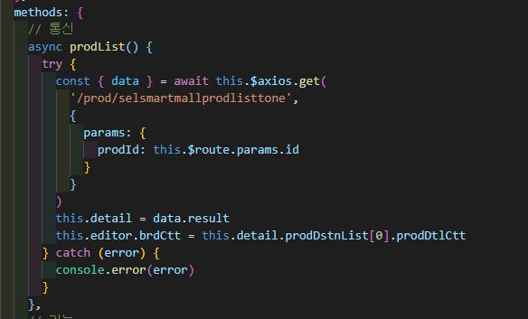
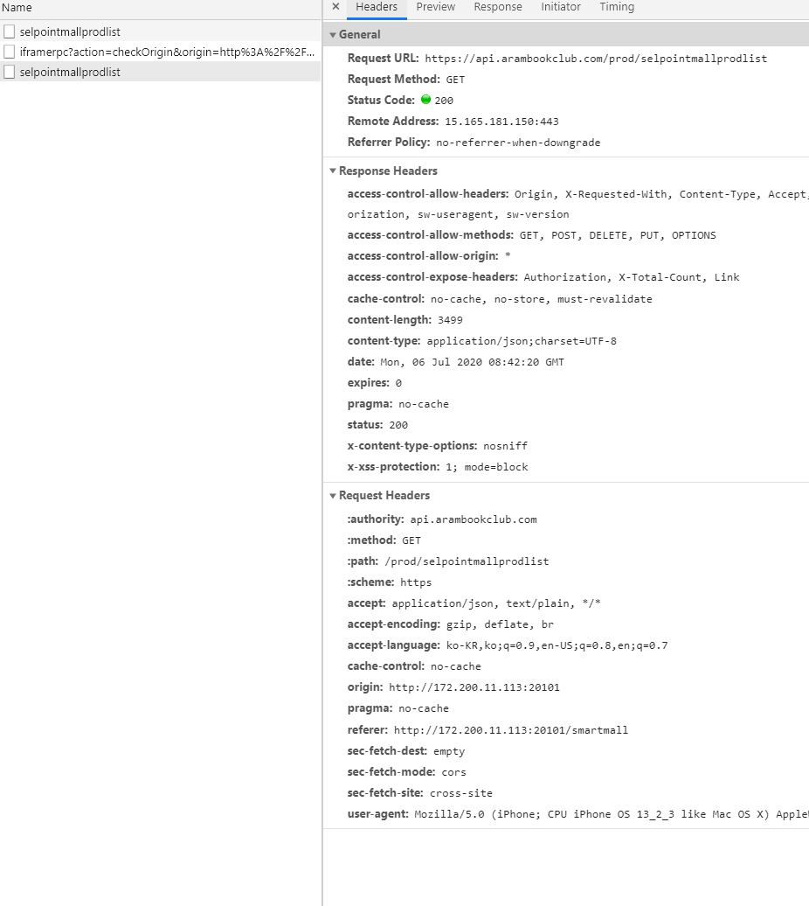
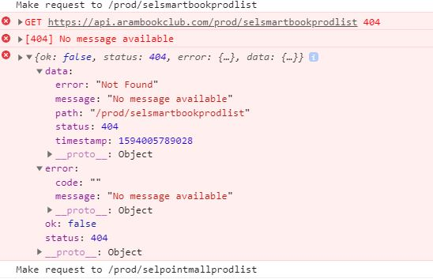
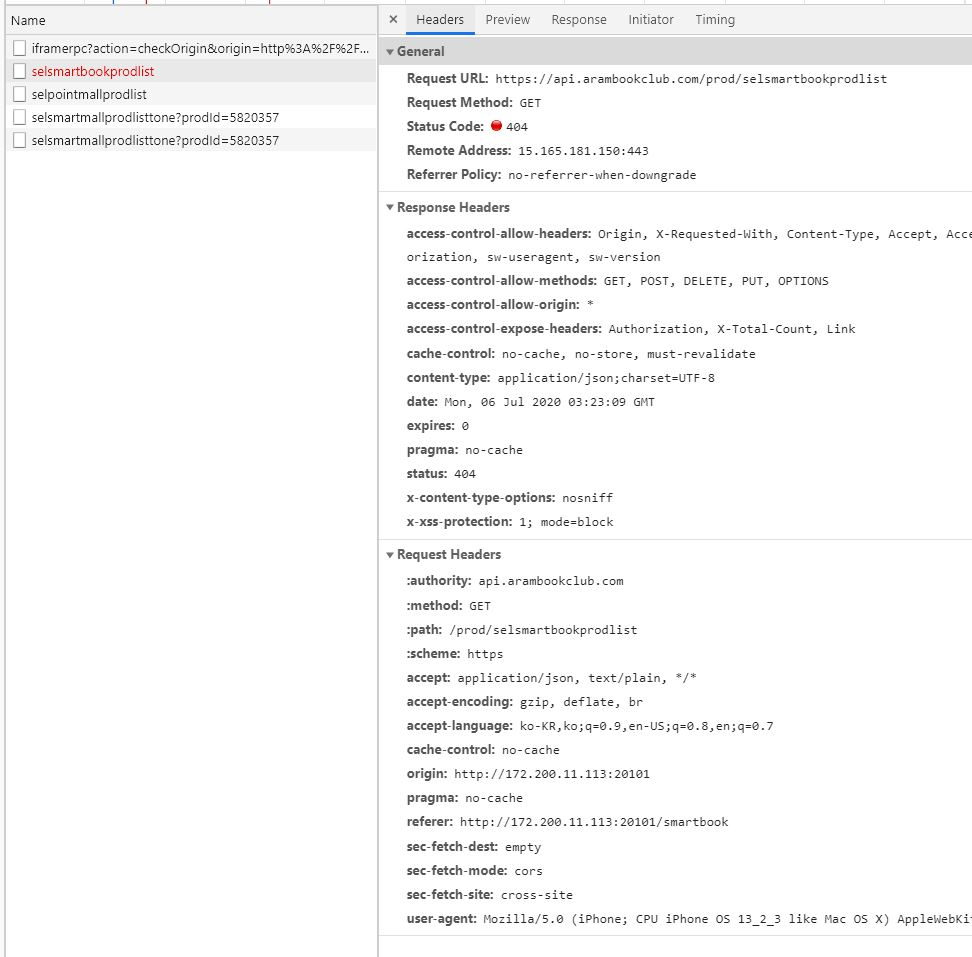

# 4주차

## 11장 예외와 에러 처리

---

### 11-1 try…catch

- 'try…catch' 문법은 'try’와 'catch’라는 두 개의 주요 블록으로 구성됩니다.

```js
try {
  // 코드...
} catch (err) {
  // 에러 핸들링
}
```



- 에러가 없는 예시: (1)과 (2)를 alert 창에 보여줌

```js
try {
  alert('try 블록 시작'); // (1) <--

  // ...에러가 없습니다.

  alert('try 블록 끝'); // (2) <--
} catch (err) {
  alert('에러가 없으므로, catch는 무시됩니다.'); // (3)
}
```



- 에러가 있는 예시: (1)과 (3)을 보여줍니다.

```js
try {
  alert('try 블록 시작'); // (1) <--

  lalala; // 에러, 변수가 정의되지 않음!

  alert('try 블록 끝(절대 도달하지 않음)'); // (2)
} catch (err) {
  alert(`에러가 발생했습니다!`); // (3) <--
}
```




에러가 발생하면 자바스크립트는 에러 상세내용이 담긴 객체를 생성합니다.

그 후, `catch` 블록에 이 객체를 인수로 전달합니다.

```js
try {
  // ...
} catch (err) { // '에러 객체', err 대신 다른 이름 사용 가능
  //
}
```

---

### 11-2 Error 객체

```js
try {
  a = f;
} catch (e) {
  console.dir(e);
}
```

---

### 11-3 finally

finally 블록은 에러가 일어나든, 일어나지 않든 반드시 호출됩니다.

```js
try {
  let a = 1;
  console.dir(a);
} catch (e) {
  console.dir(e);
} finally {
  console.log('finally')
}
```

```js
try {
  a = f;
} catch (e) {
  console.dir(e);
} finally {
  console.log('finally')
}
```
---

## 14장 비동기적 프로그래밍

---

### 14-1 쓰레드


- 자바스크립트는 단일 스레드에서 동작해서 한 번에 한가지 일만 가능합니다.

>쓰레드란?
>
>쓰레드를 이해하기전에 프로세스의 개념부터 설명하도록 하겠다.<br />
>우리가 OS에서 작업을 할 때는 워드창, 웹브라우져, 음악플레이어정도는 동시에 켜둔 상태에서 작업을 하고 있다.<br />
>동시에 이러한 작업이 이루어질 수 있는 것은 CPU가 시간을 분할하여 CPU를 사용할 수 있는 제어권을<br />
>각각의 프로그램에게 한번씩 나누어주고 있기 때문이다.<br /><br />
>보통 이 하나의 작업 즉, 운영체제에서 실행중인 하나의 프로그램을 프로세스라고 하며<br />
>작업이 여러 개 이루어진다는 것은 프로세스가 여러개가 동시에 동작하고 있다는 의미이다.<br />
>그리고 이처럼 두개 이상의 프로세스가 실행되는 것을 멀티프로세스 라고 하며<br />
>이 멀티프로세스를 실행하여 일을 처리하는 것을 멀티 태스킹이라고 한다.
>
>쓰레드는 위에서 설명한 프로세스 내에서 실행되는 세부 작업의 단위이다. 여러개의 쓰레드가 모여 하나의 프로세스를 구성하며,<br />
>이 하나의 프로세스를 구성하는 여러개의 쓰레드를 멀티쓰레드라고 부르고 하나일 경우 단일스레드 싱글스레드라고 부른다.

- 자바스크립트는 비동기적 프로그래밍 언어이다.

>자바스크립트의 비동기 처리란 특정 코드의 연산이 끝날 때까지 코드의 실행을 멈추지 않고<br />
>다음 코드를 먼저 실행하는 자바스크립트의 특성을 의미합니다.

---

### 14-2 콜백

콜백은 무엇인가 일을 다른 객체에게 시키고, 그 일이 끝나는 것을 기다리는 것이 아니라 그 객체가 나를 다시

부를 때까지 다른 일을 하고 있는 것이며, 다른 함수의 인자로도 이용할 수도 있고 객체의 프로퍼티로도 사용합니다.

항상 그런 것은 아니지만 보통 콜백은 익명 함수로 사용합니다.

콜백의 대표적인 예로 setTimeout 이 있습니다.

```js
console.log('Hello');
setTimeout(function () {
	console.log('Bye');
}, 3000);
console.log('Hello Again');
```

비동기적 실행의 가장 큰 목적은 아무것도 차단하지않는 다는 것에 있습니다.

동기적 코드의 동작은 시간의 흐름대로 순서를 지키며 진행되기 때문에 익숙하고, 이해하기 쉽지만

javascript 코드의 실행환경이 싱글쓰레드 기반이기 때문에, 싱글 쓰레드 실행환경에서 이런 동기적인 코드를

사용할 때 쓰레드의 블록킹(blocking) 현상이 발생한다.

```
블로킹은 자신의 수행결과가 끝날 때까지 제어권을 갖고 있는 것을 의미합니다.
```
```
논블로킹은 자신이 호출되었을 때 제어권을 바로 자신을 호출한 쪽으로 넘기며,

자신을 호출한 쪽에서 다른 일을 할 수 있도록 하는 것을 의미합니다.
```
---

### 14-3 스코프와 비동기적 실행

```js
function countdown(){
	let i;
	console.log("Countdown");
	for(i=5; i>=0; i--){
		setTimeout(function(){
			console.log(i===0 ? "Go!" : i);
		}, (5-i)*1000);
	}
}
countdown();
```

카운트다운을 하는 함수를 만들었음에도 기대와는 다르게 위의 콘솔은 -1이 6번 나오고 그 이유는 변수를 for 루프 밖에서

선언했으므로 for 루프가 실행을 마치고 i의 값이 -1이 되었을때 콜백이 실행되기 때문입니다.

이는 스코프와 비동기적 실행이 어떻게 연관이 있는지 이해하는 것이 중요하며, countdown을 호출하면 변수 i가 들어있는

클로저가 생성되고 for 루프 안에서 만드는 콜백은 모두 i에 접근할 수 있고, 그들이 접근하는 i는 똑같은 i입니다.

문제는 같은 i임에도 setTimeout 을 실행시키는 i(5 ~ 0)와 console.log 에 사용되는 i(-1)가 다르다는 점인데 이 부분은

스코프(클로저)와 관련된 문제이며, 어떤 스코프에서 선언이 되었느냐의 차이입니다.

```js
function countdown(){
	console.log("Countdown");
	for(let i=5; i>=0; i--){
		setTimeout(function(){
			console.log(i===0 ? "Go!" : i);
		}, (5-i)*1000);
	}
}
countdown();
```

---

### 14-4 Promise

프로미스가 만들어진 이유 : https://programmingsummaries.tistory.com/325

프로미스 쉽게 설명 : https://jeong-pro.tistory.com/128

```js
const param = true;
const promise1 = new Promise(function(resolve,reject){
    if(param){
      resolve(function() {console.log(1)}());
    }
    else{
      reject("아닌데");
    }
});
const promise2 = new Promise(function(resolve,reject){
    if(param){
      resolve(function() {console.log(2)}());
    }
    else{
      reject("아닌데2");
    }
});
Promise.all([promise1,promise2]).then(function(values){
    console.log("1,2,3 모두완료",values);
});
```

프로미스 체인 : https://ko.javascript.info/promise-chaining

---

## 15장 날짜와시간

https://dororongju.tistory.com/116

---

## 16장 Math

http://tcpschool.com/javascript/js_standard_math

---

## 17장 정규표현식

https://poiemaweb.com/js-regexp

---

## 19장 Ajax